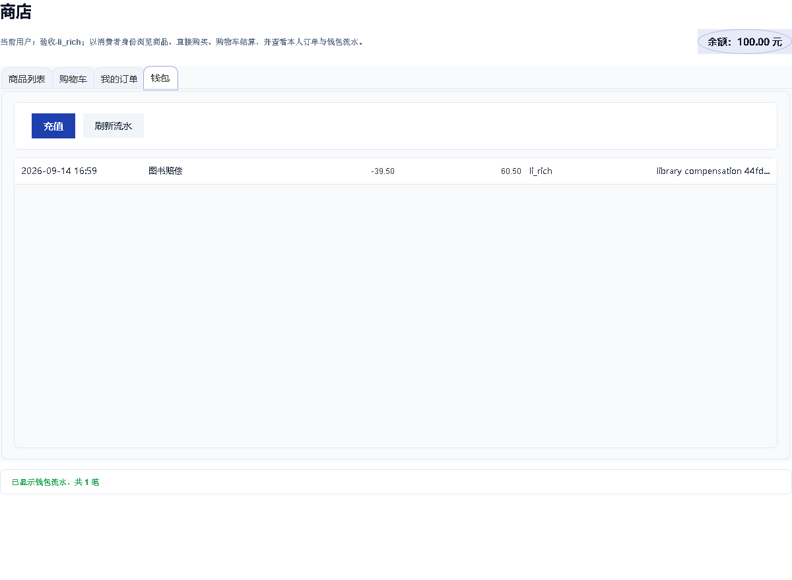
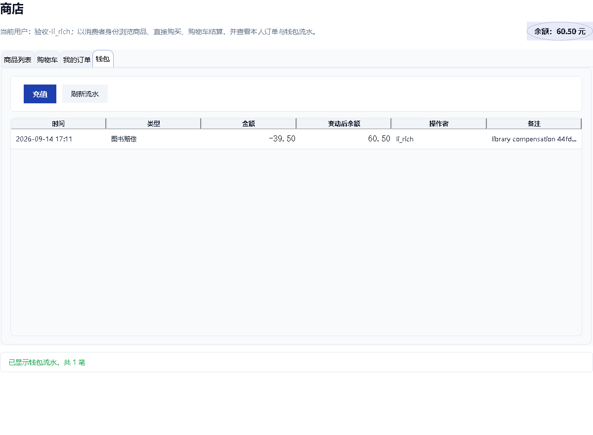
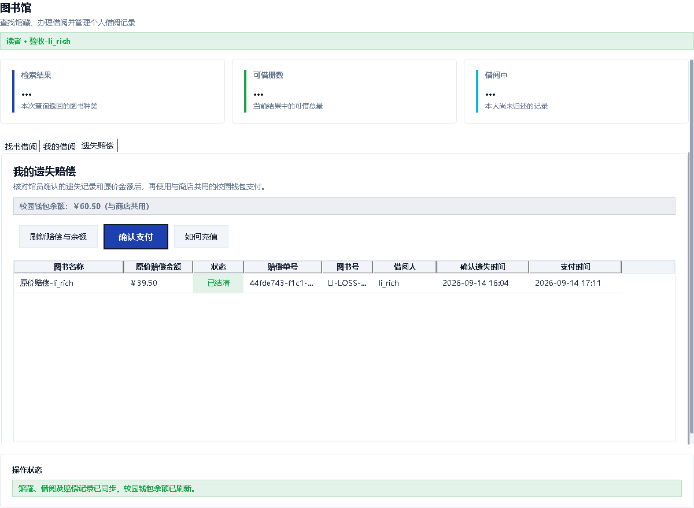

# PR74 合并前复核证据（2026-09-14）

对应组长要求的四项检查。原提交 `c377c218fef0d8621f3a552f648d4443bf18581b` 的第 1–3 项通过；**第 4 项真实页面组件联调发现商店余额漏刷，因此不能把原提交记作四项全部通过。** 修复提交为 `8808663693b43ef1e5a7985af4bee97910516e0d`。本目录后续提交只保存证据，不改变已测试的业务代码。

本次没有合并 `main`，仍由组长复核、审查和确认 CI 后决定。原演示库及历史备份未被覆盖；只操作新建的独立副本。文本输出按原字节归档为 `.txt`，没有把摘要冒充 Maven 输出。数据库、JAR、完整 Surefire XML（含本机环境属性）不提交；复现工具、命令及 SHA-256 随证据提供。

## 1. 原提交完整 Maven 回归

执行前后确认 HEAD 为 `c377c218`，工作区无源代码修改，未注入本目录的辅助类。Windows、Temurin JDK `1.8.0_502`、Maven `3.9.16`。

```powershell
# 本机 Java 默认 user.home 指向 C:\；显式使用已有 Maven 缓存，不改变测试参数。
$env:MAVEN_OPTS = '-Dmaven.repo.local=C:\Users\ASUS\.m2\repository'
mvn -B -Dstyle.color=never package "-DforkCount=0"
```

实际退出码 **0**，`BUILD SUCCESS`；完成于 `2026-09-14T17:00:33+08:00`，用时 7:21。

| 模块 | 原提交测试数 | 失败 | 错误 | 跳过 |
| --- | ---: | ---: | ---: | ---: |
| common | 4 | 0 | 0 | 0 |
| user-management | 44 | 0 | 0 | 0 |
| student-management | 22 | 0 | 0 | 0 |
| course-selection | 78 | 0 | 0 | 0 |
| library | 49 | 0 | 0 | 0 |
| store | 180 | 0 | 0 | 0 |
| server | 339 | 0 | 0 | 0 |
| client | 208 | 0 | 0 | 0 |
| **合计** | **924** | **0** | **0** | **0** |

原始完整输出：[full-maven-c377c218.txt](full-maven-c377c218.txt)。在随后专项测试覆盖报告之前，从各模块 Surefire XML 汇总并保存：[full-c377c218-counts.json](full-c377c218-counts.json)。日志中有故障注入测试主动打印的异常及原有 shade/日志依赖警告，以实际测试汇总和退出码为准。

环境说明：最初未指定本地 Maven 仓库时，在测试开始前因无法创建 `C:\.m2\repository` 退出；设置上述 `MAVEN_OPTS` 后才执行此处正式完整回归。正式输出开头的 Windows 启动器 `Access is denied.` 未导致 Maven 退出或跳过测试，原文保留。

## 2. 原提交单独运行真实 Access + TCP 测试

保持 HEAD 为 `c377c218` 和相同环境，完整回归结束后独立执行组长指定命令：

```powershell
mvn -q -pl server -am "-Dtest=LibraryAcceptanceDataTest,LibrarySocketConcurrencyTest" "-Dsurefire.failIfNoSpecifiedTests=false" "-DforkCount=0" test
```

实际退出码 **0**。`-q` 不显示成功测试总计，故同时附上本次单独执行产生的两份 Surefire 文本报告，不能只凭安静控制台声称通过。

| 测试类 | 测试数 | 失败 | 错误 | 跳过 | 耗时 |
| --- | ---: | ---: | ---: | ---: | ---: |
| LibraryAcceptanceDataTest | 4 | 0 | 0 | 0 | 17.10 s |
| LibrarySocketConcurrencyTest | 7 | 0 | 0 | 0 | 13.97 s |

证据：[控制台](access-tcp-c377c218.txt)、[数据测试报告](access-data-report-c377c218.txt)、[TCP 测试报告](access-tcp-report-c377c218.txt)。测试使用实际 `ServerApplication`、TCP Socket、Access 持久化；不是内存库替身，也不是多台实体机器或多服务器压力认证。

## 3. 既有 Access 数据库副本迁移

来源为此前已经存在的 `library-demo-50.before-compensation.20260909.accdb` 历史演示备份。原文件 SHA-256：

```text
5D076EF3DC8F750D603663B45E8416158BA77350F09204DA05FA48C4658267AA
```

先复制字节完全相同的新 `legacy-source.accdb`。该旧备份早于赔偿表：**仅在新副本执行前置 016 表结构，并通过正式旧版兼容服务新增两次借阅、确认遗失和一次付款**，形成待赔/已赔/扣款均非空的迁移输入。不是向原文件造数据，也不是以空表证明赔偿和钱包保真。准备后的副本 SHA-256：

```text
d89935add5f24d982ab21a37b6a8cc35f9a82ce57a11e9ab2df6dd2d8452eb94
```

对没有服务器占用的准备副本，实际执行正式包装脚本：

```powershell
.\scripts\Upgrade-LibraryDatabase.ps1 `
  -Source target/pr74-evidence/migration/legacy-source.accdb `
  -Output target/pr74-evidence/migration/upgraded.accdb -SourceStopped
```

脚本退出码 **0**。随后用 Jackcess 只读遍历全部旧业务表，按列名和值规范化、排序，逐表比较全部行完全相同（不是仅比较行数）；再调用生产 `LibraryCopyIntegrity.verify` 校验新增实体册和记录关联。

| 指标 | 迁移前 | 迁移后 |
| --- | ---: | ---: |
| 图书种类 | 50 | 50 |
| 图书汇总总量（不含遗失） | 148 | 148 |
| 可借 | 147 | 147 |
| 在借 BORROWED | 1 | 1 |
| 已归还 RETURNED | 4 | 4 |
| 遗失待赔 LOST | 1 | 1 |
| 已赔 COMPENSATED | 1 | 1 |
| 赔偿单：待付 / 已付 | 1 / 1 | 1 / 1 |
| 钱包账户 / 流水行数 | 4 / 1 | 4 / 1 |

旧库没有实体册表。迁移后新建 **150 册 = AVAILABLE 147 + BORROWED 1 + LOST 2**；其中 2 册遗失分别对应待赔和已赔，不能错误地要求实体册总行数等于不含遗失的图书汇总 148。

所有原有表内容及钱包金额、流水字段均保持一致；原备份和准备源副本都未因升级被改写。实际输出包括 `ALL_EXISTING_TABLE_ROWS_IDENTICAL=true`、`COPY_INTEGRITY_VERIFIED=true`、`SOURCE_UNCHANGED=true`、`MIGRATION_EVIDENCE=PASS`。

证据：[准备记录](migration-prepare.txt)、[正式脚本输出](migration-upgrade.txt)、[逐表哈希与完整性核对](migration-verify.txt)；工具：[MigrationEvidence.java](tools/MigrationEvidence.java)。输入备份含本地演示资料，未上传二进制库。其他成员可以对自己的停用旧库副本按同样方法复核；非同源库的数量与哈希应以其自身迁移前快照为准。

## 4. 图书馆赔偿与商店钱包页面联调

使用正式 `New-LibraryAcceptanceData.ps1` 已生成的独立验收库 `library-acceptance-20260914.accdb`，每轮复制一份全新工作副本。生成库基线 SHA-256（本次未修改）：

```text
6BAE54C51693905E1951530A75398AE9605A13A2F5DB275810AFEC0FF66A4569
```

两轮均启动独立的真实 `ServerApplication` 连接各自 Access 文件，真实 TCP 登录虚构验收账号 `li_rich`，使用正式 `LibraryPanel` 和 `StorePanel`。

### 原提交复现的缺陷

先打开商店钱包，余额 100.00 元；经图书馆页面提交入口支付待赔 39.50 元，再触发原商店“刷新流水”按钮。

- 图书馆余额及服务端钱包余额变为 60.50 元。
- 商店流水正确显示一笔 −39.50 元、结余 60.50 元。
- **商店页头仍是 100.00 元**。原因为缓存商店重新进入不重查钱包，原刷新流水方法也只加载流水。
- [原始联调输出](wallet-baseline.txt) 明确记录 `BASELINE_FAIL_STALE_BALANCE`。观察基线模式不把预期缺陷当作程序崩溃，故该辅助命令退出 0 **不代表页面一致性通过**。



### 修复及通过结果

`8808663` 只修改客户端 `MainFrame` / `StorePanel` 并新增 5 项回归测试：从其他模块返回缓存商店时重查共享钱包；刷新流水和进入钱包页同时重查余额；用请求代次忽略迟到的旧余额和旧流水响应。未改接口、DTO、扣款算法、权限或服务器事务。

从同一生成库再复制新库，重新执行相同真实页面组件 + TCP + Access 流程。修复后：

| 时点 | 图书馆余额 | 商店页头 | 商店图书赔偿流水 | 流水结余 |
| --- | ---: | ---: | --- | ---: |
| 支付前 | 100.00 | 100.00 | 无 | — |
| 支付 39.50 后，刷新商店 | 60.50 | 60.50 | 仅 1 笔，−39.50 | 60.50 |
| 重复提交同一赔偿支付 | 60.50（TCP 核对） | 不额外扣款 | 仍仅 1 笔（TCP 核对） | 60.50 |

证据：[修复后实际输出](wallet-fixed.txt)、[支付前商店页](wallet-fixed-store-before.png)、[支付前图书馆页](wallet-fixed-library-before.png)、[辅助组件测试源代码](tools/WalletUiEvidence.java)。打印的 `amountCents` 和 `balanceAfterCents` 是分；页面截图显示元。





测试边界：本机 Windows 原生窗口自动化连续超时，因此这是**真实 Swing 页面组件集成测试与组件渲染截图，不是人工整窗点击录像**。在 Swing 事件线程调用图书馆确认对话框之后的实际提交入口、触发商店按钮，未伪造 TCP 响应或设置余额/表格。确认弹窗和 `MainFrame` 整窗导航不在此辅助流程范围；回到缓存页面刷新入口另有单元测试。渲染仅为无窗口组件补挂真实 JTable 表头并执行正常布局，不修改业务数据。若最终验收要求人工作用整窗、不同 DPI 或实际多机网络，仍需组员现场签验，不能由这些截图代替。

## 5. 修复提交的回归与复现

新增 `StoreWalletRefreshTest` 5 项覆盖：刷新按钮、切入钱包标签、重进缓存商店、旧余额迟到、旧流水迟到。为可控地制造回包顺序，这 5 项单元测试使用 Socket 替身；上面的第 4 项独立联调使用真实服务端与 Access，两者不可混称。

```powershell
mvn -B -pl client -am "-Dtest=StoreWalletRefreshTest" "-Dsurefire.failIfNoSpecifiedTests=false" "-DforkCount=0" package
```

实际退出码 0，**5 项，失败 0、错误 0、跳过 0**：[原始输出](wallet-refresh-test.txt)、[该次 Surefire 报告](wallet-refresh-test-report.txt)。

修复提交完整回归结果在独立 [修复回归记录](fixed-regression.md) 中提供。任何后续证据提交都不替代对业务代码提交的测试。

辅助工具在项目根目录编译，不加入 Maven 生产/测试源码，不随客户端发布：

```powershell
New-Item -ItemType Directory -Path target/pr74-reproduce/classes
javac -encoding UTF-8 -cp server/target/vCampusServer.jar -d target/pr74-reproduce/classes docs/evidence/pr74-20260914/tools/MigrationEvidence.java
javac -encoding UTF-8 -cp client/target/vCampusClient.jar -d target/pr74-reproduce/classes docs/evidence/pr74-20260914/tools/WalletUiEvidence.java
# 对迁移前后文件只读核对（完整性校验只连接迁移输出）
java '-Dfile.encoding=UTF-8' -cp 'target/pr74-reproduce/classes;server/target/vCampusServer.jar' cn.vcampus.server.MigrationEvidence verify PATH_TO_SOURCE_COPY PATH_TO_UPGRADED_COPY
# 在另一终端运行：使用本分支构建的服务器，库必须是新复制的未消费验收库。
java '-Dvcampus.library.maxActiveLoans=5' -jar server/target/vCampusServer.jar --db PATH_TO_FRESH_ACCEPTANCE_COPY --port 19175
# 待服务器启动后执行组件联调，演示账号/密码仅供隔离验收环境。
java '-Djava.awt.headless=true' '-Dswing.noxp=true' '-Dfile.encoding=UTF-8' -cp 'target/pr74-reproduce/classes;client/target/vCampusClient.jar' cn.vcampus.client.view.WalletUiEvidence 19175 target/pr74-reproduce/wallet
```

如需生成迁移输入的非空赔偿场景，辅助工具还提供 `prepare OLD_BACKUP NEW_SOURCE database/migrations/016_library_compensation.up.sql`；它拒绝已有输出、先逐字节复制、只在新副本添加前置表和演示用例。该命令针对本报告的 B049/B050、demo_student/demo_librarian 旧演示备份，不能直接套用到不含这些演示数据的其他旧库。复现时仅用演示资料，绝不能把真实用户库用作变更性验收。
