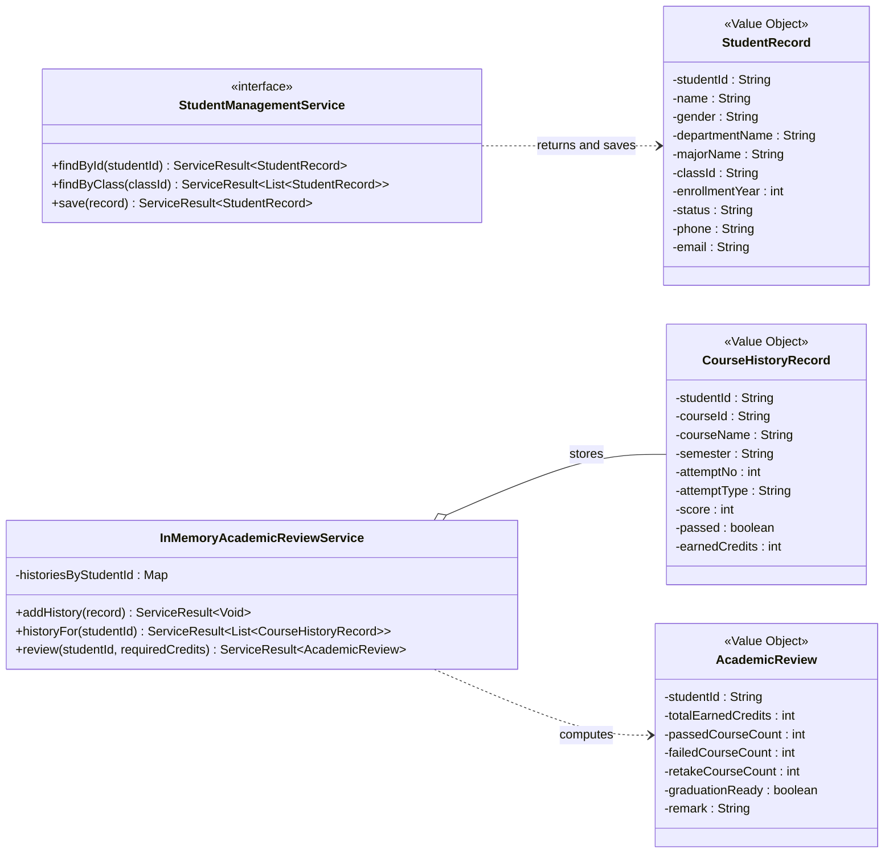
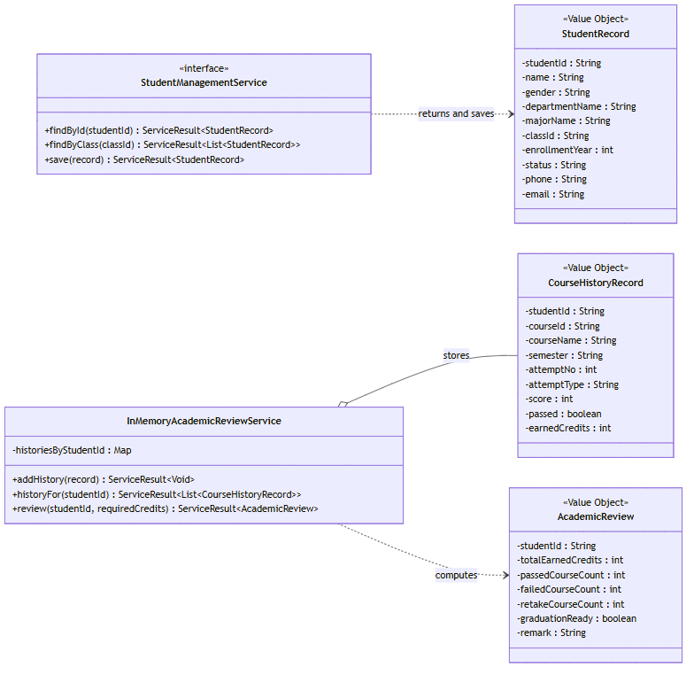

# 学生学籍管理模块类图提取与讲解

下图从根目录 `类图.drawio.html` 的 `student_management` 区域单独提取，保留原图中的五个类及其核心关系。



静态预览：



## 1. 图中五个类分别表示什么

### StudentManagementService

这是学生学籍模块对外暴露的业务接口。原图中有三个方法：

```java
findById(studentId)
findByClass(classId)
save(record)
```

它只定义“系统能做什么”，不负责说明数据存放在内存还是 Access 数据库。

当前实际代码已经增加：

```java
findByUserId(userId)
findMyStudentProfile(userId)
findByMajor(majorName)
```

实际文件：[StudentManagementService.java](../student-management/src/main/java/cn/vcampus/student/StudentManagementService.java)

### StudentRecord

`StudentRecord` 表示一名学生的完整基础档案。原图包含：

| 字段 | 含义 |
|---|---|
| `studentId` | 学号，学籍和课程业务使用的稳定编号 |
| `name` | 姓名 |
| `gender` | 性别 |
| `departmentName` | 院系 |
| `majorName` | 专业 |
| `classId` | 班级编号 |
| `enrollmentYear` | 入学年份 |
| `status` | 学籍状态 |
| `phone` | 手机 |
| `email` | 邮箱 |

当前实际代码还增加了 `userId`，用于把登录账号与学籍档案绑定。

```text
userId：谁登录了系统
studentId：哪个学生档案参与学籍、选课和成绩业务
```

学生本人访问必须经过：

```text
Token → userId → tblStudent.user_id → studentId
```

实际文件：[StudentRecord.java](../student-management/src/main/java/cn/vcampus/student/StudentRecord.java)

### CourseHistoryRecord

`CourseHistoryRecord` 表示学生对一门课程的一次修读尝试，不是一门课程本身。

例如某学生第一次数据库课程未通过，后来重修通过：

```text
DB101 / 2025-2026-1 / 第1次 / 首修 / 52分 / 未通过 / 0学分
DB101 / 2025-2026-2 / 第2次 / 重修 / 75分 / 通过   / 3学分
```

两条记录都会保留，因此系统能够判断：

- 学生是否曾经挂科；
- 是否参加过重修；
- 课程最终是否通过；
- 实际获得了多少学分。

实际文件：[CourseHistoryRecord.java](../student-management/src/main/java/cn/vcampus/student/CourseHistoryRecord.java)

### InMemoryAcademicReviewService

这个类是学业审查的内存实现。它在程序内保存：

```text
Map<studentId, List<CourseHistoryRecord>>
```

也就是一个学号对应多条课程历史。它可以新增测试记录、查询历史和生成审查结果，主要用于无数据库演示和单元测试。

正式 Access 模式使用 `AccessAcademicReviewService`，从 `tblCourseResult` 和 `tblCourse` 读取数据。

实际文件：

- [InMemoryAcademicReviewService.java](../student-management/src/main/java/cn/vcampus/student/InMemoryAcademicReviewService.java)
- [AccessAcademicReviewService.java](../server/src/main/java/cn/vcampus/server/AccessAcademicReviewService.java)

### AcademicReview

`AcademicReview` 是一次学业审查的结果对象。原图包含：

```text
totalEarnedCredits   累计获得学分
passedCourseCount    已通过课程数
failedCourseCount    当前未解决挂科数
retakeCourseCount    历史重修课程数
graduationReady      是否达到当前审查要求
remark               审查说明
```

当前实际代码还增加：

```text
reviewId
requiredEarnedCredits
reviewedBy
reviewedAt
getCreditShortfall()
```

学分缺口计算为：

```text
max(0, requiredEarnedCredits - totalEarnedCredits)
```

当前 `graduationReady` 更准确地说是阶段性审查结果：累计学分达到要求并且没有未解决挂科。最终毕业资格还需要结合培养方案和必修课程完成情况。

实际文件：[AcademicReview.java](../student-management/src/main/java/cn/vcampus/student/AcademicReview.java)

## 2. 图中的三条关系

### StudentManagementService 使用 StudentRecord

接口的查询方法返回 `StudentRecord`，保存方法接收 `StudentRecord`。因此它们是“业务接口使用数据对象”的依赖关系。

### InMemoryAcademicReviewService 聚合 CourseHistoryRecord

空心菱形表示聚合。审查服务内部保存多条课程历史记录，但课程历史仍然是可以独立存在的数据对象。

### InMemoryAcademicReviewService 生成 AcademicReview

审查服务读取一组课程历史，按课程号合并首修和重修记录，最后计算出 `AcademicReview`。

## 3. 当前实际学籍代码的完整分层

原图只展示了核心领域类，当前代码已经形成完整链路：

```text
StudentManagementPanel
        ↓
RemoteStudentService
        ↓
STUDENT_QUERY / STUDENT_UPDATE
        ↓
ServerApplication
        ↓
StudentMessageHandler
        ↓
StudentManagementService
        ↓
DefaultStudentManagementService
        ↓
StudentRepository
       ↙                    ↘
InMemoryStudentRepository   AccessStudentRepository
```

各层职责：

| 层 | 主要类 | 职责 |
|---|---|---|
| 页面层 | `StudentManagementPanel` | 查询条件、表格、编辑表单和状态提示 |
| 客户端适配 | `RemoteStudentService` | 构造消息并通过 Socket 发送 |
| 服务器权限 | `StudentMessageHandler` | Token、角色、数据范围和字段级权限 |
| 业务层 | `DefaultStudentManagementService` | 查询、保存、冲突和异常结果转换 |
| 数据访问层 | `StudentRepository` | 定义学生数据的存取合同 |
| 持久化层 | `AccessStudentRepository` | 使用参数化 SQL 读写 `tblStudent` |

## 4. 学生本人查询流程

```text
StudentManagementPanel 点击“查询本人”
→ RemoteStudentService.currentStudent(token)
→ StudentQueryCommand.self(token)
→ ServerApplication 分发给 StudentMessageHandler
→ 校验 STUDENT_READ
→ currentSession(token) 得到 userId
→ StudentManagementService.findByUserId(userId)
→ AccessStudentRepository 查询 tblStudent.user_id
→ 返回完整 StudentRecord
```

学生不需要手工输入学号，也不能通过修改请求中的学号查看其他学生。

## 5. 教务管理员维护流程

教务管理员可以按学号、班级和专业查询。班级或专业查询返回列表后，页面会根据选中行的学号再次读取完整档案，再允许保存。

```text
按班级/专业查询
→ 返回学生摘要列表
→ 选择某一学生
→ 按 studentId 加载完整 StudentRecord
→ 修改档案或学籍状态
→ StudentMessageHandler 校验 STUDENT_WRITE
→ AccessStudentRepository.save
```

页面在请求期间会禁用表格和保存按钮；查询失败会清空旧档案，防止把上一名学生的信息错误保存。

## 6. 教师授课范围查询

教师不能任意查询所有学生。当前完善分支通过下列关系判断授课范围：

```text
教师登录 userId
→ tblTeacher.user_id 得到 teacherId
→ tblCourseOffering.teacher_id 找到教师教学班
→ tblCourseSelection.offering_id 找到选课记录
→ 只允许查看 status=ACTIVE 的学生
```

相关类：

- `TeacherStudentAccessPolicy`
- `AccessTeacherStudentAccessPolicy`
- `StudentMessageHandler`

无授课关系数据的内存模式默认拒绝教师按学号查询。

## 7. 学业审查和待重修逻辑

学籍模块通过 `AcademicReviewService` 提供：

```java
historyFor(studentId)
pendingRetakes(studentId)
review(studentId, requiredCredits)
latestReview(studentId)
```

待重修判断规则：

```text
同一课程只要有一次 passed=true
→ 不需要重修

同一课程所有尝试均未通过
→ 返回最新一次失败记录
```

`retakeCourseCount` 表示历史上曾经重修过的课程数量；`pendingRetakes` 表示当前仍未通过、需要继续重修的课程，两者不能混用。

## 8. 与选课模块的关系

学籍模块向选课系统提供学生资料：

```text
StudentRecord
├── studentId
├── majorName
├── enrollmentYear
├── status
└── userId

AcademicReviewService.pendingRetakes(studentId)
        ↓
StudentSelectionProfile
        ↓
选课 V2 判断首修/重修轮次
```

选课模块负责课程目录、教学班、培养方案、选课轮次、选课记录和成绩写入；学籍模块负责学生主档案、课程历史读取和学业判断。

## 9. 数据库责任

| 表 | 学籍模块 | 选课/教务模块 |
|---|---|---|
| `tblStudent` | 负责维护 | 只读 |
| `tblClass` | 负责基础班级信息 | 使用 |
| `tblCourse` | 读取课程名称和规定学分 | 负责维护 |
| `tblCourseResult` | 读取历史成绩 | 负责写入成绩和通过结果 |
| `tblAcademicReview` | 读取快照和实时计算 | 确认并写入审核快照 |
| `tblCourseOffering` | 用于教师范围校验 | 负责维护教学班 |

## 10. 原图与当前代码的差异

根目录 `类图.drawio.html` 的学籍区域只画了五个早期核心类，尚未展示：

- `StudentRecord.userId`；
- `findByUserId`、`findMyStudentProfile`、`findByMajor`；
- `StudentRepository` 和两个 Repository 实现；
- `DefaultStudentManagementService`；
- `AcademicReviewService`、`AccessAcademicReviewService`；
- `StudentMessageHandler`；
- `RemoteStudentService`、`StudentManagementPanel`；
- `StudentSelectionProfileAdapter`；
- 教师授课范围校验类；
- 要求学分、审核人、审核时间和学分缺口。

因此，上面的图用于展示“原整体类图中你的区域是什么样的”；本说明后半部分用于解释“我们当前实际已经实现到什么程度”。
